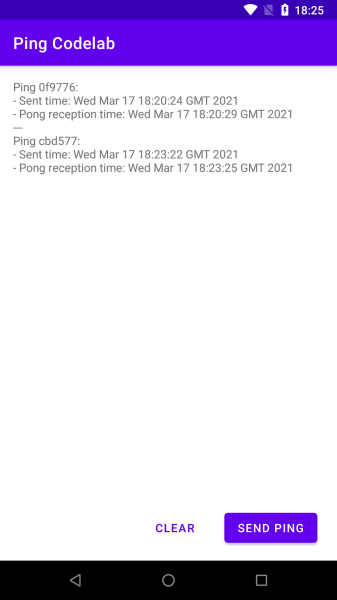
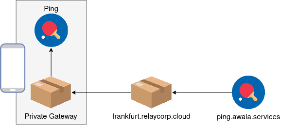
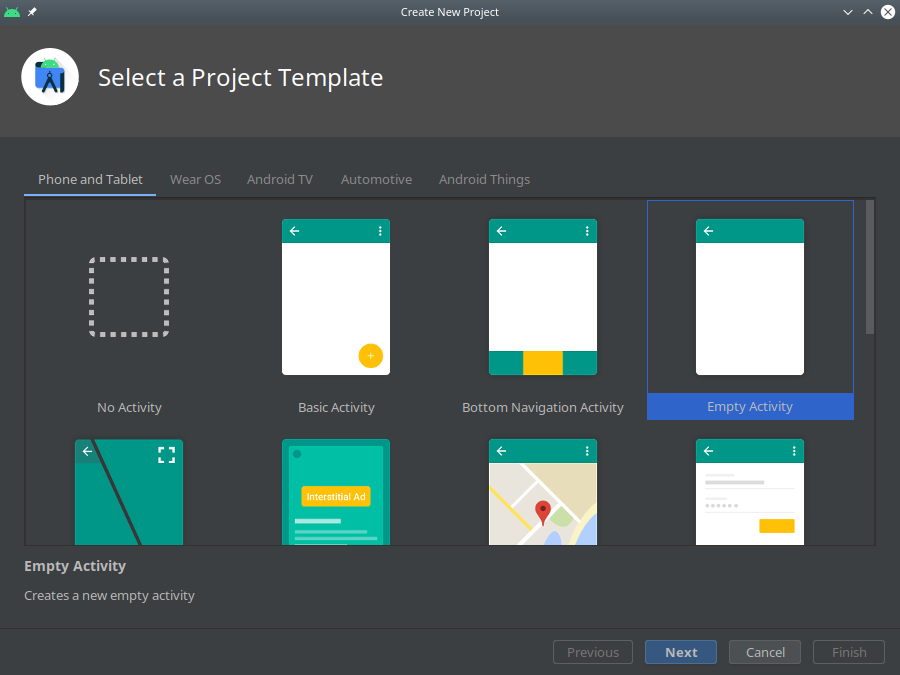
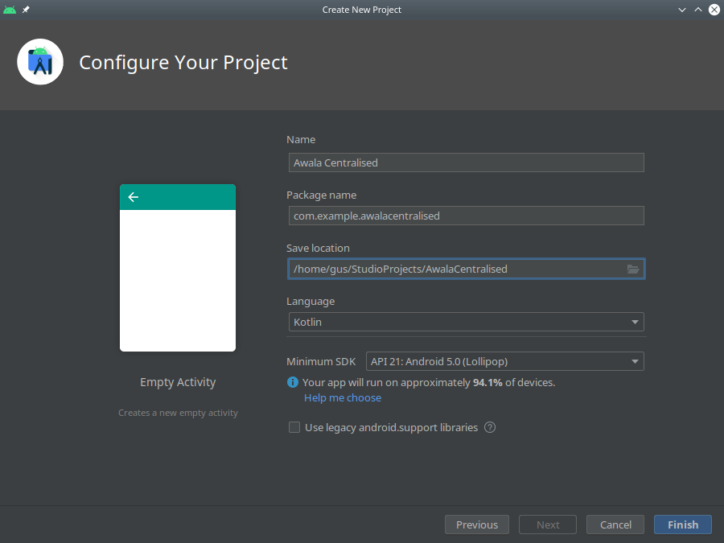
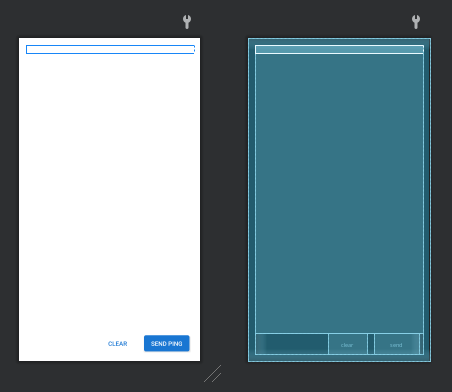

summary: Build an Android app for a centralised Awala service
id: android-centralised
categories: Android
tags: medium
status: Published
authors: Gus Narea
Feedback Link: https://github.com/AwalaNetwork/codelabs

# Build an Android app for a centralised Awala service

## Overview

Duration: 0:5:00

An _Awala service_ is a collection of mobile, desktop, server-side and/or CLI apps that exchange mutually-intelligible messages using _endpoints_. Server-side apps exposed as Internet hosts will have _public endpoints_ (e.g., `your-service.com`), whilst all other apps (e.g., mobile, desktop) will have _private endpoints_.

The service is _centralised_ if there's a public endpoint as the sender or recipient of all messages, _decentralised_ if all endpoints are private. Alternatively, if there's a public endpoint involved in some but not necessarily all messages, then the service is _hybrid_.

Anyone can define Awala services, but to keep this codelab simple, we'll just build an Android app for [Awala Ping](https://specs.awala.network/RS-014), which is a trivial service used to test Awala implementations.

### What you'll build

You'll build an Android app that will send _ping_ messages to the public endpoint at `ping.awala.services`, and it'll also receive _pong_ messages from said public endpoint. Awala Ping is a hybrid service, but we'll use it as a centralised service here. Your app will look like this:



As illustrated in the picture below, when you send a ping from your Android app to `ping.awala.services`, the message will pass through the [private gateway](https://play.google.com/store/apps/details?id=tech.relaycorp.gateway) and then on to the public gateway (at `frankfurt.relaycorp.cloud`, for example).


On the other hand, `ping.awala.services` has to respond to your ping by sending a pong message back via the same gateways as illustrated below:



Awala requires messages bound for private endpoints (such as the one inside this Android app) to be pre-authorised by the recipient, so that means your ping message will have to include an authorisation for `ping.awala.services` to reply with a pong message. In a regular service, authorisations would be issued once and renewed periodically, but because `ping.awala.services` is stateless, the Android app will have to issue an authorisation each time.

You'll be using the Android endpoint library _[awaladroid](https://github.com/relaycorp/awala-endpoint-android)_ to send and receive messages via the private gateway.

### What you'll need

- Prior experience building Android apps. If you've never built an Android app, the [first app guide](https://developer.android.com/training/basics/firstapp) will teach you what you need to complete this codelab.
- [Android Studio](https://developer.android.com/studio) 4.1+.
- An Android phone or table running Android 5+.
- The [private gateway](https://play.google.com/store/apps/details?id=tech.relaycorp.gateway) installed on that Android device.

## Set up a new project

Duration: 0:2:00

Let's create a new project on Android Studio by going to `File` -> `New` -> `New project...`. Once in the wizard, select the empty activity template and click `Next`.



In the final screen, make sure to leave Kotlin as the programming language and API 21 as the minimum Android SDK.



### Define dependencies

Start by adding the following line to `gradle.properties`:

```
# Workaround for https://issuetracker.google.com/issues/159151549
android.jetifier.blacklist = bcprov-jdk15on-1.*.jar
```

Next, open `app/build.gradle` and add the following inside `dependencies { ... }`:

```groovy
    // Awala
    implementation 'tech.relaycorp:awaladroid:1.5.1'
    // Preferences
    implementation 'androidx.preference:preference-ktx:1.1.1'
    implementation 'com.github.tfcporciuncula.flow-preferences:flow-preferences:1.3.4'
    implementation 'com.squareup.moshi:moshi:1.9.3'
    implementation 'com.squareup.moshi:moshi-kotlin:1.9.3'
```

Then add the following repositories after `plugins { ... }`:

```groovy
repositories {
    maven { url "https://jitpack.io" }
    maven { url "https://dl.bintray.com/relaycorp/maven" }
}
```

Android Studio should now be recommending that you do a project sync following the change to your build file. Accept it.

## Implement the ping repository

Duration: 0:2:00

You're going to use [shared preferences](https://developer.android.com/training/data-storage/shared-preferences) to store data for each ping sent and its corresponding pong message (if any), and each record will be serialised with JSON using the [Moshi library](https://github.com/square/moshi).

To make it easier to manipulate and query the data in the shared preferences file, create a high-level _ping repository_ class using the code below:

```kotlin
package com.example.pingcodelab

import com.squareup.moshi.Moshi
import com.squareup.moshi.Types
import com.tfcporciuncula.flow.FlowSharedPreferences
import com.tfcporciuncula.flow.Serializer
import java.util.UUID
import kotlinx.coroutines.ExperimentalCoroutinesApi

data class PingMessage(
    val id: String = UUID.randomUUID().toString(),
    val sent: Long = System.currentTimeMillis(),
    val received: Long? = null
)

@ExperimentalCoroutinesApi
class PingRepository(
    private val flowSharedPreferences: FlowSharedPreferences,
    private val moshi: Moshi
) {
    private val repo by lazy {
        val serializer = object : Serializer<List<PingMessage>> {
            private val adapter = moshi.adapter<List<PingMessage>>(
                Types.newParameterizedType(
                    List::class.java,
                    PingMessage::class.java
                )
            )

            override fun deserialize(serialized: String) =
                adapter.fromJson(serialized) ?: emptyList()

            override fun serialize(value: List<PingMessage>) =
                adapter.toJson(value)
        }

        flowSharedPreferences.getObject(
            "pings",
            serializer,
            emptyList()
        )
    }

    fun observe() = repo.asFlow()

    fun get(id: String) =
        repo.get().firstOrNull { it.id == id }

    suspend fun set(message: PingMessage) {
        repo.setAndCommit(
            repo.get()
                .filterNot { it.id == message.id }
                    + message
        )
    }

    suspend fun clear() {
        repo.setAndCommit(emptyList())
    }
}
```

## Create a custom `Application`

Duration: 0:2:00

You're going to create to a custom `Application` to do two things as soon as the app starts:

- Create a singleton for the ping repository. However, in production you may want to use dependency injection.
- Set up the Awaladroid library before any communication takes place.

To achieve the above, create a file called `App.kt` in the same directory as `MainActivity.kt` and add the following to the new file:

```kotlin
package com.example.pingcodelab

import android.app.Application
import com.squareup.moshi.Moshi
import com.squareup.moshi.kotlin.reflect.KotlinJsonAdapterFactory
import com.tfcporciuncula.flow.FlowSharedPreferences
import kotlinx.coroutines.CoroutineScope
import kotlinx.coroutines.Dispatchers
import kotlinx.coroutines.ExperimentalCoroutinesApi
import kotlinx.coroutines.SupervisorJob
import kotlinx.coroutines.launch
import tech.relaycorp.awaladroid.Awala

@ExperimentalCoroutinesApi
class App : Application() {
    private val coroutineContext = Dispatchers.IO + SupervisorJob()

    lateinit var pingRepository: PingRepository

    override fun onCreate() {
        super.onCreate()

        pingRepository = PingRepository(
            FlowSharedPreferences(getSharedPreferences("ping", MODE_PRIVATE)),
            Moshi.Builder().add(KotlinJsonAdapterFactory()).build()
        )

        CoroutineScope(coroutineContext).launch {
            Awala.setup(this@App)
        }
    }
}
```

Then add the following attribute to the `&lt;application>` element of `AndroidManifest.xml`:

```
android:name=".App"
```

## Implement the main activity

Duration: 0:5:00

### Define the user interface

Replace the contents of `src/main/res/layout/activity_main.xml` with the following:

```xml
<?xml version="1.0" encoding="utf-8"?>
<LinearLayout xmlns:android="http://schemas.android.com/apk/res/android"
              xmlns:tools="http://schemas.android.com/tools"
              android:layout_width="match_parent"
              android:layout_height="match_parent"
              android:clipChildren="false"
              android:clipToPadding="false"
              android:orientation="vertical"
              android:padding="16dp"
              tools:context=".MainActivity">

    <androidx.core.widget.NestedScrollView
            android:layout_width="match_parent"
            android:layout_height="0dp"
            android:layout_weight="1">

        <TextView
                android:id="@+id/pings"
                android:layout_width="match_parent"
                android:layout_height="wrap_content" />
    </androidx.core.widget.NestedScrollView>

    <LinearLayout
            android:layout_width="match_parent"
            android:layout_height="wrap_content"
            android:gravity="end"
            android:orientation="horizontal">

        <com.google.android.material.button.MaterialButton
                android:id="@+id/clear"
                style="@style/Widget.MaterialComponents.Button.TextButton"
                android:layout_width="wrap_content"
                android:layout_height="wrap_content"
                android:layout_gravity="top|end"
                android:layout_marginHorizontal="8dp"
                android:text="Clear" />

        <com.google.android.material.button.MaterialButton
                android:id="@+id/send"
                android:layout_width="wrap_content"
                android:layout_height="wrap_content"
                android:layout_marginHorizontal="8dp"
                android:text="Send Ping" />
    </LinearLayout>
</LinearLayout>
```

You should now see the following when you activate the `Design` view of the activity:



### Apply the kotlin-android-extensions plugin

You'll be using synthetic binding, so you have to apply the `kotlin-android-extensions` plugin in `app/build.gradle` by adding the following line inside `plugins { ... }`:

```groovy
    id 'kotlin-android-extensions'
```

Now accept Android Studio's prompt to sync the project.

### Implement the activity

Your main activity will be responsible for the following:

- _[Binding](https://developer.android.com/guide/components/bound-services)_ to the private gateway when the activity starts and unbinding when it's destroyed.
- Sending pings when the user taps the "Send ping" button.
- Displaying the sent pings on the screen, along with the reception time of their respective pong messages.
- Emptying the ping repository when the user taps the "Clear" button.

Generally speaking, binding must take place at some point after calling `Awala.setup()` (currently done in your `App` class) and before communication starts. You're keeping the app bound to the private gateway throughout the lifetime of the main activity just to keep the codelab simple, but in production you'll want to bind to the private gateway independently of the lifecycle of the main activity.

Replace the contents of `MainActivity.kt` with the following to implement all the above, except for the sending of pings, which you'll do later:

```kotlin
package com.example.pingcodelab

import android.os.Bundle
import androidx.appcompat.app.AppCompatActivity
import androidx.lifecycle.lifecycleScope
import java.util.Date
import kotlinx.android.synthetic.main.activity_main.clear
import kotlinx.android.synthetic.main.activity_main.pings
import kotlinx.android.synthetic.main.activity_main.send
import kotlinx.coroutines.CoroutineScope
import kotlinx.coroutines.Dispatchers
import kotlinx.coroutines.ExperimentalCoroutinesApi
import kotlinx.coroutines.flow.launchIn
import kotlinx.coroutines.flow.onEach
import kotlinx.coroutines.launch
import kotlinx.coroutines.withContext
import tech.relaycorp.awaladroid.GatewayClient

@ExperimentalCoroutinesApi
class MainActivity : AppCompatActivity() {
    private val pingRepository by lazy { (applicationContext as App).pingRepository }

    private val backgroundContext = lifecycleScope.coroutineContext + Dispatchers.IO
    private val backgroundScope = CoroutineScope(backgroundContext)

    override fun onCreate(savedInstanceState: Bundle?) {
        super.onCreate(savedInstanceState)
        setContentView(R.layout.activity_main)

        lifecycleScope.launch {
            withContext(backgroundContext) {
                GatewayClient.bind()
            }
            send.isEnabled = true
        }

        pingRepository
            .observe()
            .onEach {
                pings.text = it.joinToString("\n") { message ->
                    "Ping (sent=${Date(message.sent)}) (received=${
                        message.received?.let {
                            Date(message.received)
                        }
                    })"
                }
            }
            .launchIn(lifecycleScope)

        send.setOnClickListener {
            backgroundScope.launch {
                sendPing()
            }
        }

        clear.setOnClickListener {
            backgroundScope.launch {
                pingRepository.clear()
            }
        }
    }

    private suspend fun sendPing() {
        // TODO
    }

    override fun onDestroy() {
        super.onDestroy()
        GatewayClient.unbind()
    }
}
```

### Request permission to communicate with the private gateway

Add the following line inside the `&lt;manifest>` of your `AndroidManifest.xml` file for your app to be able to communicate with the [private gateway](https://play.google.com/store/apps/details?id=tech.relaycorp.gateway):

```xml
<uses-permission android:name="tech.relaycorp.gateway.SYNC" />
```

## Configure endpoints

Whilst Internet apps communicate with each other using _clients_ and _servers_, Awala apps use _endpoints_. Awala makes extensive use of cryptography to ensure the communication between endpoints is private and secure, which requires some upfront work before the actual communication can start. 

Fortunately, you'll be using the [Android endpoint library](https://github.com/relaycorp/awala-endpoint-android), which abstracts the low-level details so that you can focus on the important features that will make your app stand out from the rest.

### Configure the third-party endpoint

Because you're implementing a centralised service, all the endpoints in the service will be communicating with a specific public endpoint, so you'll need the organisation operating the public endpoint to give you some information about it. In this case, you'll use a public endpoint operated by Relaycorp, whose parameters are:

- Public address: `ping.awala.services`.
- Identity certificate: Can be downloaded from `https://pong-pohttp.awala.services/certificates/identity.der`.

**Apps in a centralised service must be shipped with the data above**. Identity certificates will expire eventually and the operator should also periodically rotate them, so you should make sure that your app is distributed with a relatively recent version of the public endpoint's identity certificate. You may want to retrieve the latest version of the certificate as part of the release process.

To keep things simple in this codelab, you're just going to manually download the identity certificate once and save it on `app/src/main/res/raw/pub-endpoint-identity.der`. If you're running Linux or macOS, the following should work from the root of the project:

```shell
mkdir app/src/main/res/raw
curl -o app/src/main/res/raw/pub-endpoint-identity.der \
  https://pong-pohttp.awala.services/certificates/identity.der
```

With the certificate on disk, it's now time to register the public endpoint the first time the app starts.

### Configure your own endpoint


## Send pings

Duration: 0:10:00

## Receive pongs

Duration: 0:10:00

Awala requires messages bound for private endpoints to be pre-authorised by the recipient in order to prevent abuse, but no authorisation is required when the message is bound for public endpoints.

## That's it!

Duration: 0:3:00

Well done!

### What's next?


### Further reading

- Reference documentation
