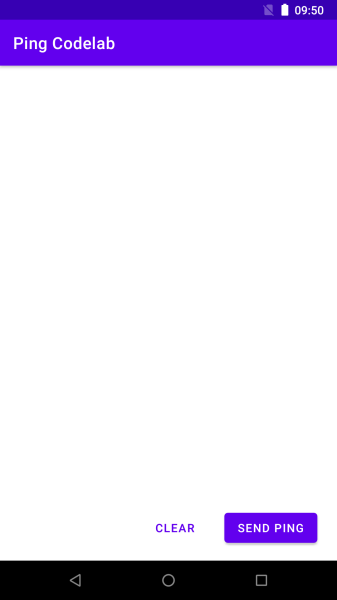
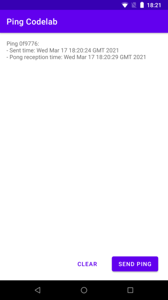

summary: Build an Android app for a centralised Awala service
id: android-centralised
categories: Android
tags: medium
status: Published
authors: Gus Narea
Feedback Link: https://github.com/AwalaNetwork/codelabs

# Build an Android app for a centralised Awala service

## Overview

Duration: 0:5:00

An _Awala service_ is a collection of mobile, desktop, server-side and/or CLI apps that exchange mutually-intelligible messages using _endpoints_. Server-side apps exposed as Internet hosts will have _public endpoints_ (e.g., `your-service.com`), whilst all other apps (e.g., mobile, desktop) will have _private endpoints_.

The service is _centralised_ if there's a public endpoint as the sender or recipient of all messages, or _decentralised_ if all endpoints are private. Alternatively, if there's a public endpoint involved in some but not necessarily all messages, then the service is _hybrid_.

Anyone can define Awala services, but to keep this codelab simple, we'll just build an Android app for [Awala Ping](https://specs.awala.network/RS-014), which is a trivial service used to test Awala itself.

### What you'll build

You'll build an Android app that will send _ping_ messages to the public endpoint at `ping.awala.services`, and it'll also receive _pong_ messages from said public endpoint. Awala Ping is a hybrid service, but we'll use it as a centralised service here. Your app will look like this:


As illustrated in the picture below, when you send a ping from your Android app to `ping.awala.services`, the message will pass through the [private gateway](https://play.google.com/store/apps/details?id=tech.relaycorp.gateway), then on to the public gateway (at `frankfurt.relaycorp.cloud`, for example), and it'll then arrive at the public endpoint.


On the other hand, `ping.awala.services` has to respond to your ping by sending a pong message back via the same gateways as illustrated below:


Positive
: The Ping service uses a request-response pattern because its sole purpose is to test that endpoints can send and receive data. However, **endpoints in your own services can send messages at any time** and there's no requirement to respond to messages. Your endpoints should just push data to their peers whenever new data is available, without waiting for anyone else to "initiate" the communication.

Awala requires messages bound for private endpoints (such as the one inside this Android app) to be pre-authorised by the recipient, so that means your ping message will have to include an authorisation for `ping.awala.services` to reply with a pong message. In most services, authorisations would be issued once and renewed periodically, but `ping.awala.services` is stateless, so your app will have to issue an authorisation each time.

You'll be using the Android endpoint library _[awaladroid](https://github.com/relaycorp/awala-endpoint-android)_ to send and receive messages via the private gateway.

### What you'll need

- Prior experience building Android apps. If you've never built an Android app, the [first app guide](https://developer.android.com/training/basics/firstapp) will teach you what you need to complete this codelab.
- [Android Studio](https://developer.android.com/studio) 4.1+.
- An Android phone or tablet running Android 5+.
- The [private gateway](https://play.google.com/store/apps/details?id=tech.relaycorp.gateway) installed on that Android device.

### In case you need help

If you have any issues in the course of this codelab, please post a message on [our forum](https://community.awala.network/) and we'll help you out! You can also check out the [final version of the app you're going to build](https://github.com/AwalaNetwork/codelabs/tree/main/examples/android-centralised).

## Set up a new project

Duration: 0:3:00

Let's create a new project on Android Studio by going to `File` -> `New` -> `New project...`. Once in the wizard, select the empty activity template and click `Next`.


In the final screen, make sure to leave Kotlin as the programming language and API 26 as the minimum Android SDK ([we plan to restore support for API 21-25 soon](https://github.com/relaycorp/awala-endpoint-android/issues/87)).


### Define dependencies

Start by adding the following line to `gradle.properties`:

```
# Workaround for https://issuetracker.google.com/issues/159151549
android.jetifier.blacklist = bcprov-jdk15on-1.*.jar
```

Next, open `app/build.gradle` and add the following repositories after `plugins { ... }`:

```groovy
repositories {
    maven { url "https://jitpack.io" }
    maven { url "https://dl.bintray.com/relaycorp/maven" }
}
```

Next, add the following line to the `compileOptions` inside `android { ... }` so that you can [use Java 8 features](https://developer.android.com/studio/write/java8-support) (e.g., `ZonedDateTime`):

```groovy
coreLibraryDesugaringEnabled true
```

Then add the following inside `dependencies { ... }`:

```groovy
    // Support modern Java classes (e.g., ZonedDateTime)
    coreLibraryDesugaring 'com.android.tools:desugar_jdk_libs:1.1.5'
    // Awala
    implementation 'com.github.relaycorp:awala-endpoint-android:1.6.13'
    // Preferences
    implementation 'androidx.preference:preference-ktx:1.1.1'
    implementation 'com.fredporciuncula:flow-preferences:1.5.0'
    implementation 'com.squareup.moshi:moshi:1.9.3'
    implementation 'com.squareup.moshi:moshi-kotlin:1.9.3'
```

Now add the following line inside `plugins { ... }` so that you can use synthetic binding and data binding in this codelab:

```groovy
    id 'kotlin-android-extensions'
    id 'kotlin-kapt'
```

Finally, accept Android Studio's prompt to sync the project.

## Implement the ping repository

Duration: 0:2:00

You're going to use [shared preferences](https://developer.android.com/training/data-storage/shared-preferences) to store data for each ping sent and its corresponding pong message (if any), and each record will be serialised with JSON using the [Moshi library](https://github.com/square/moshi).

To make it easier to manipulate and query the data in the shared preferences file, create a high-level _ping repository_ class using the code below:

```kotlin
package com.example.pingcodelab

import com.squareup.moshi.Moshi
import com.squareup.moshi.Types
import com.fredporciuncula.flow.preferences.FlowSharedPreferences
import com.fredporciuncula.flow.preferences.Serializer

data class Ping(
    val id: String,
    val pingDate: Long = System.currentTimeMillis(),
    val pongDate: Long? = null
)

class PingRepository(
    private val flowSharedPreferences: FlowSharedPreferences,
    private val moshi: Moshi
) {
    private val repo by lazy {
        val serializer = object : Serializer<List<Ping>> {
            private val adapter = moshi.adapter<List<Ping>>(
                Types.newParameterizedType(
                    List::class.java,
                    Ping::class.java
                )
            )

            override fun deserialize(serialized: String) =
                adapter.fromJson(serialized) ?: emptyList()

            override fun serialize(value: List<Ping>) =
                adapter.toJson(value)
        }

        flowSharedPreferences.getObject(
            "pings",
            serializer,
            emptyList()
        )
    }

    fun observe() = repo.asFlow()

    fun get(id: String) =
        repo.get().first { it.id == id }

    suspend fun set(message: Ping) {
        repo.setAndCommit(
            repo.get()
                .filterNot { it.id == message.id }
                    + message
        )
    }

    suspend fun clear() {
        repo.setAndCommit(emptyList())
    }
}
```

## Create a custom Application

Duration: 0:2:00

You're going to create to a custom `Application` to do two things as soon as the app starts:

- Create a singleton for the ping repository. However, in production you may want to use dependency injection.
- Set up the Awaladroid library before any communication takes place.

To achieve the above, create a file called `App.kt` in the same directory as `MainActivity.kt` and add the following to the new file:

```kotlin
package com.example.pingcodelab

import android.app.Application
import com.squareup.moshi.Moshi
import com.squareup.moshi.kotlin.reflect.KotlinJsonAdapterFactory
import com.fredporciuncula.flow.preferences.FlowSharedPreferences
import kotlinx.coroutines.*
import kotlinx.coroutines.channels.Channel
import tech.relaycorp.awaladroid.Awala

@ExperimentalCoroutinesApi
class App : Application() {
    val setupDone = Channel<Unit>(0)

    private val coroutineContext = Dispatchers.IO + SupervisorJob()

    lateinit var pingRepository: PingRepository

    override fun onCreate() {
        super.onCreate()

        pingRepository = PingRepository(
            FlowSharedPreferences(getSharedPreferences("ping", MODE_PRIVATE)),
            Moshi.Builder().add(KotlinJsonAdapterFactory()).build()
        )

        CoroutineScope(coroutineContext).launch {
            Awala.setup(this@App)
            setUpEndpoints()

            // Signal that the setup is complete
            setupDone.offer(Unit)

            collectMessages()
        }
    }

    private suspend fun setUpEndpoints() {
        // TODO
    }

    private fun collectMessages() {
        // TODO
    }
}
```

Then add the following attribute to the `&lt;application>` element of `AndroidManifest.xml`:

```
android:name=".App"
```

## Implement the main activity

Duration: 0:3:00

### Define the user interface

Replace the contents of `src/main/res/layout/activity_main.xml` with the following:

```xml
<?xml version="1.0" encoding="utf-8"?>
<LinearLayout xmlns:android="http://schemas.android.com/apk/res/android"
              xmlns:tools="http://schemas.android.com/tools"
              android:layout_width="match_parent"
              android:layout_height="match_parent"
              android:clipChildren="false"
              android:clipToPadding="false"
              android:orientation="vertical"
              android:padding="16dp"
              tools:context=".MainActivity">

    <androidx.core.widget.NestedScrollView
            android:layout_width="match_parent"
            android:layout_height="0dp"
            android:layout_weight="1">

        <TextView
                android:id="@+id/pings"
                android:layout_width="match_parent"
                android:layout_height="wrap_content" />
    </androidx.core.widget.NestedScrollView>

    <LinearLayout
            android:layout_width="match_parent"
            android:layout_height="wrap_content"
            android:gravity="end"
            android:orientation="horizontal">

        <com.google.android.material.button.MaterialButton
                android:id="@+id/clear"
                style="@style/Widget.MaterialComponents.Button.TextButton"
                android:layout_width="wrap_content"
                android:layout_height="wrap_content"
                android:layout_gravity="top|end"
                android:layout_marginHorizontal="8dp"
                android:backgroundTint="@color/design_default_color_background"
                android:text="Clear" />

        <com.google.android.material.button.MaterialButton
                android:id="@+id/send"
                android:layout_width="wrap_content"
                android:layout_height="wrap_content"
                android:layout_marginHorizontal="8dp"
                android:enabled="false"
                android:text="Send Ping" />
    </LinearLayout>
</LinearLayout>
```

### Implement the activity

Your main activity will be responsible for the following:

- Sending pings when the user taps the "Send ping" button.
- Displaying the sent pings on the screen, along with the reception time of their respective pong messages.
- Emptying the ping repository when the user taps the "Clear" button.

Replace the contents of `MainActivity.kt` with the following to implement all the above, except for the sending of pings, which you'll do later:

```kotlin
package com.example.pingcodelab

import android.os.Bundle
import androidx.appcompat.app.AppCompatActivity
import androidx.lifecycle.lifecycleScope
import kotlinx.android.synthetic.main.activity_main.*
import kotlinx.coroutines.CoroutineScope
import kotlinx.coroutines.Dispatchers
import kotlinx.coroutines.ExperimentalCoroutinesApi
import kotlinx.coroutines.flow.launchIn
import kotlinx.coroutines.flow.onEach
import kotlinx.coroutines.launch
import tech.relaycorp.awaladroid.GatewayClient
import tech.relaycorp.awaladroid.messaging.OutgoingMessage
import tech.relaycorp.awaladroid.messaging.ParcelId
import java.time.ZonedDateTime
import java.util.*

@ExperimentalCoroutinesApi
class MainActivity : AppCompatActivity() {
    private val context by lazy { applicationContext as App }

    private val backgroundContext = lifecycleScope.coroutineContext + Dispatchers.IO
    private val backgroundScope = CoroutineScope(backgroundContext)

    override fun onCreate(savedInstanceState: Bundle?) {
        super.onCreate(savedInstanceState)
        setContentView(R.layout.activity_main)

        lifecycleScope.launch {
            // Wait for the app setup to complete if it's still going
            context.setupDone.receive()

            send.isEnabled = true
        }

        context.pingRepository
            .observe()
            .onEach { pings.text = formatPings(it) }
            .launchIn(lifecycleScope)

        send.setOnClickListener {
            backgroundScope.launch {
                sendPing()
            }
        }

        clear.setOnClickListener {
            backgroundScope.launch {
                context.pingRepository.clear()
            }
        }
    }

    private fun formatPings(it: List<Ping>) =
        it.joinToString("\n---\n") { ping ->
            val pingDate = Date(ping.date)
            val pongDate = ping.pongDate?.let {
                Date(ping.received)
            } ?: "Pending"
            val shortId = ping.id.takeLast(6)
            listOf(
                "Ping $shortId:",
                "- Sent time: $pingDate",
                "- Pong reception time: $pongDate"
            ).joinToString("\n")
        }

    private suspend fun sendPing() {
        // TODO
    }
}
```

### Install the app

Install the app on your Android device to make sure everything is working so far. The app should look like this, although buttons wouldn't be doing anything yet:



## Configure endpoints

Duration: 0:5:00

Whilst Internet apps communicate with each other using _clients_ and _servers_, Awala apps use _endpoints_. Awala makes extensive use of cryptography to ensure the communication between endpoints is private and secure, which requires some upfront work before the actual communication can start. 

Fortunately, awaladroid abstracts the low-level details so that you can focus on the important features that will make your app stand out from the rest.

### Configure the third-party endpoint

Because you're implementing a centralised service, all the endpoints in the service will be communicating with a specific public endpoint, so you'll need the organisation operating the public endpoint to give you some information about it. In this case, you'll use a public endpoint operated by Relaycorp, whose parameters are:

- Public address: `ping.awala.services`.
- Identity certificate: Can be downloaded from `https://pong-pohttp.awala.services/certificates/identity.der`.

**Apps in a centralised service must be shipped with the data above**. Identity certificates will expire eventually and the operator should also periodically rotate them, so you should make sure that your app is distributed with a relatively recent version of the public endpoint's identity certificate. You may want to retrieve the latest version of the certificate as part of the release process.

To keep things simple in this codelab, you're just going to manually download the identity certificate once and save it on `app/src/main/res/raw/pub_endpoint_identity.der`. If you're running Linux or macOS, the following should work from the root of the project:

```shell
mkdir app/src/main/res/raw
curl -o app/src/main/res/raw/pub_endpoint_identity.der \
  https://pong-pohttp.awala.services/certificates/identity.der
```

With the certificate on disk, it's now time to register the public endpoint the first time the app starts. You'll also need this endpoint to send pings, so you'll keep a reference to it in the `App` instance so that the main activity can access it -- in production, however, you might want to keep the two separate.

Go back to the `App` class and declare the following field:

```kotlin
lateinit var recipient: PublicThirdPartyEndpoint
```

To make sure the field is defined when the app starts, rewrite the `setUpEndpoints` method as follows:

```kotlin
private suspend fun setUpEndpoints() {
    // Load the recipient's endpoint if it exists, or import it first if necessary
    val recipientPublicAddress = "ping.awala.services"
    recipient = PublicThirdPartyEndpoint.load(recipientPublicAddress)
        ?: PublicThirdPartyEndpoint.import(
            recipientPublicAddress,
            resources.openRawResource(R.raw.pub_endpoint_identity).use {
                it.readBytes()
            }
        )
}
```

Positive
: Just so you know, the parameters passed to `import()` will change soon in a backwardly-incompatible way [to improve the security of the communication](https://github.com/relaycorp/relayverse/issues/27) by using different key pairs for encryption and digital signatures. We use semantic versioning so the change will be introduced in a major version.

### Configure your own endpoint

You now need to create a _first-party endpoint_ to be able to communicate with third-party endpoints like the one you just created for `ping.awala.services`, so let's make that first-party endpoint available when the app starts.

Go back to the `App` class and declare the following field:

```kotlin
lateinit var sender: FirstPartyEndpoint
```

Now define the field when the app starts by adding the following to the `setUpEndpoints()` method:

```kotlin
// Get or create the sender's endpoint
val globalConfig = getSharedPreferences("config", MODE_PRIVATE)
val senderPrivateAddress = globalConfig.getString("sender", null)
sender = if (senderPrivateAddress is String) {
    FirstPartyEndpoint.load(senderPrivateAddress)!!
} else {
    FirstPartyEndpoint.register().also {
        globalConfig.edit {
            putString("sender", it.privateAddress)
        }
    }
}
```

Note that you're using a shared preferences file to store the private address of the first-party endpoint you created, to avoid creating new endpoints each time the app starts. In a real app, however, you can create as many endpoints as you need -- ideally one for each third-party endpoint to keep all communication channels isolated.

## Send pings

Duration: 0:5:00

You've now completed the groundwork, so it's time to start sending pings!

Pings are JSON-serialised messages that contain a unique identifier and the authorisation for the recipient to reply with a pong message, as illustrated below:

```json
{
  "id": "<The ping id>",
  "pda": "<The Parcel Delivery Authorisation for the recipient (base64-encoded)>",
  "pda_chain": [
    "<PDA Chain, Certificate #1 (base64-encoded)>",
    "..."
  ]
}
```

Using Awala's nomenclature, each ping is a _service message_ -- as is each pong. Each message is made of a _type_ (like `application/vnd.awala.ping-v1.ping`) and its _content_ (like the JSON document above). The content is binary so that you can transmit textual and binary data.

A service message isn't transmitted as is: Instead, it's encrypted and put inside a _parcel_, which contains just enough information for gateways to route it and ensure that only pre-authorised messages are delivered.

Fortunately, awaladroid takes care of the cryptography and (un)sealing parcels, so that you can focus on the important things.

### Serialise ping messages

Let's define the JSON serialisation routine first. Create a new file called `PingSerialization.kt` in the same package as the main activity, and add the following to it:

```kotlin
package com.example.pingcodelab

import android.util.Base64
import org.json.JSONArray
import org.json.JSONObject

internal fun serializePingMessage(
    pingId: String,
    pda: ByteArray,
    pdaChain: List<ByteArray>
): ByteArray {
    val pingJSON = JSONObject()
    pingJSON.put("id", pingId)
    pingJSON.put("pda", base64Encode(pda))
    pingJSON.put("pda_chain", JSONArray(pdaChain.map { base64Encode(it) }))
    val pingJSONString = pingJSON.toString()
    return pingJSONString.toByteArray()
}

private fun base64Encode(input: ByteArray): String =
    Base64.encodeToString(input, Base64.DEFAULT)
```

### Send service message

The private gateway runs as a [bound service](https://developer.android.com/guide/components/bound-services) and you're responsible for binding to it whenever you need to send messages. Generally speaking, binding must take place at some point after calling `Awala.setup()` (currently done in your `App` class) and before communication starts.

It's up to you whether to stay bound indefinitely or only bind when necessary, but in this codelab you're going to defer the binding until the first message is sent.

Go back to the `MainActivity` class and rewrite the `sendPing()` method as follows:

```kotlin
private suspend fun sendPing() {
    // Bind to the gateway if not already bound
    GatewayClient.bind()

    val pingId = UUID.randomUUID().toString()
    val expiryDate = ZonedDateTime.now().plusDays(3)
    val authorization = context.sender.issueAuthorization(
        context.recipient,
        expiryDate
    )
    val pingMessageSerialized = serializePingMessage(
        pingId,
        authorization.pdaSerialized,
        authorization.pdaChainSerialized
    )
    val outgoingMessage = OutgoingMessage.build(
        "application/vnd.awala.ping-v1.ping",
        pingMessageSerialized,
        context.sender,
        context.recipient,
        parcelExpiryDate = expiryDate
    )
    GatewayClient.sendMessage(outgoingMessage)
    val pingMessage = Ping(pingId)
    context.pingRepository.set(pingMessage)
}
```

`GatewayClient.bind()` is idempotent, so nothing bad would happen if the app is already bound to the gateway.

### Unbind from the gateway

To unbind from the gateway when the app is no longer on the foreground, go back to the `MainActivity` class and override the `onDestroy()` method as follows:


```kotlin
override fun onDestroy() {
    super.onDestroy()

    // Unbind from the gateway if still bound
    GatewayClient.unbind()
}
```

Note that `GatewayClient.unbind()` is idempotent too.

### Test it!

Install the app and start sending pings. It should look like this:


You should be getting pongs at this point -- They're just not displayed on the screen just yet.

## Receive pongs

Duration: 0:5:00

You're now going to update the data in the ping repository to set the time when the app received each pong message. The `MainActivity` is programmed to update the screen whenever the repository changes, so those changes should be reflected on the screen almost instantly.

### Deserialise pong messages

The content of the pong message is just the respective ping id -- no JSON this time. So go back to the `PingSerialization.kt` file and add the following:

```kotlin
internal fun extractPingIdFromPongMessage(pongMessageSerialized: ByteArray): String {
    return pongMessageSerialized.toString(Charset.defaultCharset())
}
```

### Collect service messages

When the private gateway receives a message bound for one of the endpoints inside your app, it will notify your app by binding to it -- Android will then wake up your app in the background unless it's already running in the foreground.

Before awaladroid can actually collect messages, you have to define how those messages should be processed. In this codelab you're going to do that as soon as the app starts, so that you can process pong messages even when your app isn't in use.

Go to the `App` class and override the `collectMessages()` method as follows:

```kotlin
private suspend fun collectMessages() {
    GatewayClient.receiveMessages().collect {
        val pingId = extractPingIdFromPongMessage(it.content)
        val pingMessage = pingRepository.get(pingId)
        if (pingMessage != null) {
            pingRepository.set(pingMessage.copy(pongDate = System.currentTimeMillis()))
        }

        it.ack()
    }
}
```

Note that you're having to call the `ack()` method on the incoming message as soon as you finish processing it to instruct the gateway to delete its copy of the parcel. The gateway will continue to send you that message until you acknowledge it. If the processing is expensive and/or you may get many messages, you may want to add incoming messages to a background queue and acknowledge immediately.

The incoming message exposes the `type` of the message (e.g., `application/vnd.awala.ping-v1.pong`), as well as the third-party `sender` and the first-party `recipient` endpoints.

You'll notice that you're not binding to the gateway: That's because awaladroid will do it on demand when new incoming messages are available.

### Test it again!

Reinstall the app and try to send pings again. If everything works as expected, you should now see the time when the respective pong messages were received:



## That's it!

Duration: 0:3:00

Well done! You've just built an Android app for a centralised Awala service.

### What's next?

- Learn more about the [architecture of Awala services](https://awala.network/service-providers/implementation/architecture).
- Read the [API documentation for awaladroid](https://docs.relaycorp.tech/awala-endpoint-android/).
- [Join the Awala community](https://community.awala.network/) and give us some feedback on the codelab.
- [Spread the word on Twitter!](https://twitter.com/intent/tweet?url=https%3A%2F%2Fawala.network%2Fservice-providers%2F&via=AwalaNetwork&text=I%27ve%20just%20built%20an%20app%20that%20can%20sync%20with%20the%20Internet%20even%20if%20the%20user%20is%20disconnected%20from%20it%21)
- Make your Android app communicate with your own public endpoint by doing the [Node.js public endpoint codelab](/codelabs/nodejs-pong/).
