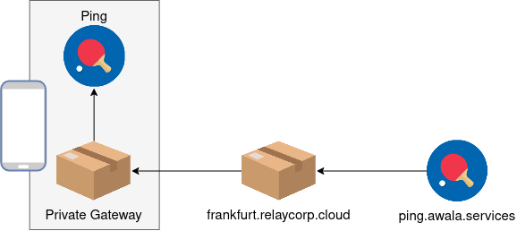

summary: Build a public endpoint using Node.js
id: nodejs-pong
categories: nodejs
tags: medium
status: Published
authors: Gus Narea
Feedback Link: https://github.com/AwalaNetwork/codelabs

# Build a public endpoint using Node.js

## Overview

Duration: 5:00

An _Awala service_ is a collection of mobile, desktop, server-side and/or CLI apps that exchange mutually-intelligible messages using _endpoints_. Server-side apps exposed as Internet hosts will have _public endpoints_ (e.g., `your-service.com`), whilst all other apps (e.g., mobile, desktop) will have _private endpoints_.

The service is _centralised_ if there's a public endpoint as the sender or recipient of all messages, or _decentralised_ if all endpoints are private. Alternatively, if there's a public endpoint involved in some but not necessarily all messages, then the service is _hybrid_.

Anyone can define Awala services, but to keep this codelab simple, we'll just build a public endpoint for [Awala Ping](https://specs.awala.network/RS-014), which is a trivial service used to test Awala itself.

### What you'll build

You'll build a Node.js HTTP server that will act as a public endpoint in the Ping service. Its job is to receive ping messages from private endpoints, such as [those in an Android app](/codelabs/android-centralised/), and return a pong message in response. You'll deploy this app to [Google App Engine](https://cloud.google.com/appengine) (GAE).

Imagine your public endpoint address is `ping.awala.services` and a private endpoint in an Android app sends you a ping, as illustrated in the picture below. When the private endpoint sends the ping, the message will pass through the [Android gateway](https://play.google.com/store/apps/details?id=tech.relaycorp.gateway), then on to a public gateway (such as `frankfurt.relaycorp.cloud`), and it'll finally arrive at your public endpoint.

On the other hand, pong messages do the same route in reverse:

Awala requires messages bound for private endpoints to be pre-authorised by the recipient, so each ping message includes an authorisation for the recipient (e.g., `ping.awala.services`) to reply with a pong message. In most services, authorisations would be issued once and renewed periodically, but public endpoints in the Ping service are meant to be stateless, so private endpoints have to issue an authorisation each time.

Awala Ping is a hybrid service, but you'll use it as a centralised service here.

Positive
: The Ping service uses a request-response pattern because its sole purpose is to test that endpoints can send and receive data. However, **endpoints in your own services can send messages at any time** and there's no requirement to respond to messages. Your endpoints should just push data to their peers whenever the data is available, without waiting for anyone else to "initiate" the communication.

### What you'll need

- Some prior experience with Node.js and JavaScript/TypeScript.
- A [Google Cloud Platform](https://cloud.google.com/) account. As of this writing, doing this codelab is within the [free quota](https://cloud.google.com/appengine/quotas), but you're responsible for checking for [any charges](https://cloud.google.com/appengine/pricing) at the time you do this codelab.
- An Android phone or table running Android 5+.
- The [private gateway](https://play.google.com/store/apps/details?id=tech.relaycorp.gateway) installed on that Android device.

### In case you need help

If you have any issues in the course of this codelab, please post a message on [our forum](https://community.awala.network/) and we'll help you out! You can also check out the [final version of the app you're going to build](https://github.com/AwalaNetwork/codelabs/tree/main/examples/nodejs-pong-final).

## Set up Google App Engine

Duration: 10:00

https://console.cloud.google.com/apis/library/cloudbuild.googleapis.com

<button>
  [Download template](/examples/nodejs-pong-template.zip)
</button>

gcloud config set project myProject

gcloud app deploy

## Generate an identity certificate

Duration: 5:00

## Process incoming pings

Duration: 10:00

## Send pongs

Duration: 10:00

## Test it with an Android app

Duration: 10:00

## That's it!

Duration: 3:00

Well done! You've just built an Android app for a centralised Awala service.

### Delete the GCP project

### What's next?

- Learn more about the [architecture of Awala services](https://awala.network/service-providers/implementation/architecture).
- Read the [API documentation for awaladroid](https://docs.relaycorp.tech/awala-endpoint-android/).
- [Join the Awala community](https://community.awala.network/) and give us some feedback on the codelab.
- [Share what you've just done on Twitter](https://twitter.com/intent/tweet?url=https%3A%2F%2Fawala.network%2Fservice-providers%2F&via=AwalaNetwork&text=I%27ve%20just%20built%20an%20app%20that%20can%20sync%20with%20the%20Internet%20even%20if%20the%20user%20is%20disconnected%20from%20it%21).
