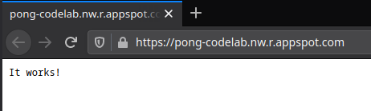
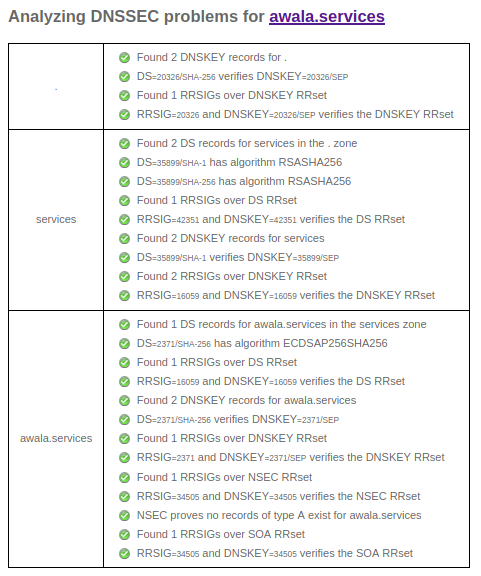
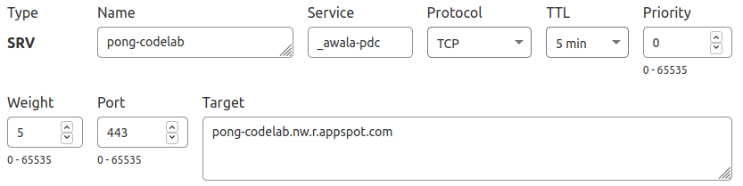
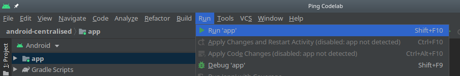

summary: Build a public endpoint using Node.js
id: nodejs-pong
categories: nodejs
tags: medium
status: Published
authors: Gus Narea
Feedback Link: https://github.com/AwalaNetwork/codelabs

# Build a public endpoint using Node.js

## Overview

Duration: 10:00

An _Awala service_ is a collection of mobile, desktop, server-side and/or CLI apps that exchange mutually-intelligible messages using _endpoints_. Server-side apps exposed as Internet hosts will have _public endpoints_ (e.g., `your-service.com`), whilst all other apps (e.g., mobile, desktop) will have _private endpoints_.

You're going to work with the [Awala Ping](https://specs.awala.network/RS-014) service in this codelab. Ping is a trivial service used to test Awala itself by having private endpoints send _pings_ to other endpoints and getting _pongs_ in response. The recipient of the ping can be public or private, but here you'll only use a public endpoint.

### What you'll build

You'll build a [Fastify](https://www.fastify.io)-powered HTTP server that will act as a public endpoint in the Ping service, and you'll deploy it to [Google App Engine](https://cloud.google.com/appengine) (GAE).

Say your public endpoint address is `ping.awala.services` and a private endpoint in an Android app sends you a ping, as illustrated in the picture below. When the private endpoint sends the ping, the message will pass through the [private gateway](https://play.google.com/store/apps/details?id=tech.relaycorp.gateway), then on to a public gateway (such as `frankfurt.relaycorp.cloud`), and it'll finally arrive at your public endpoint.


On the other hand, pong messages do the same route in reverse:


Awala requires messages bound for private endpoints to be pre-authorised by the recipient, so each ping message includes an authorisation for the recipient (e.g., `ping.awala.services`) to reply with a pong message. In most services, authorisations would be issued once and renewed periodically, but public endpoints in the Ping service are meant to be stateless, so private endpoints have to issue an authorisation each time.

Positive
: The Ping service uses a request-response pattern because its sole purpose is to test that endpoints can send and receive data. However, **endpoints in your own services can send messages at any time** and there's no requirement to respond to messages. Your endpoints should just push data to their peers whenever new data is available, without waiting for anyone else to "initiate" the communication.

### What you'll need

- Very basic understanding of Node.js, JavaScript/TypeScript and HTTP.
- [Node.js](https://nodejs.org/en/download/) 14+. We'll assume that `npm`, `npx` and `node` are in your `$PATH`.
- A [Google Cloud Platform](https://cloud.google.com/) (GCP) account. As of this writing, running this codelab alone won't exceed your [free quota](https://cloud.google.com/appengine/quotas).
- A domain name with DNSSEC enabled and the ability to create SRV records. If you don't have one already, register a cheap one with your favourite registrar. Alternatively, if you know of a service offering this for free, use it and please [let us know about it](https://github.com/AwalaNetwork/codelabs/issues/5).
- An Android phone or tablet running Android 5+.
- The [private gateway](https://play.google.com/store/apps/details?id=tech.relaycorp.gateway) installed on that Android device.
- [Android Studio](https://developer.android.com/studio). We won't assume you know how to use it, but we'll assume it's properly installed. This requirement will go away once we release [Awala Ping](https://github.com/relaycorp/relaynet-ping-android/) on the Google Play Store.

### In case you need help

If you have any issues in the course of this codelab, please post a message on [our forum](https://community.awala.network/) and we'll help you out! You can also check out the [final version of the app you're going to build](https://github.com/AwalaNetwork/codelabs/tree/main/examples/nodejs-pong).

## Set up Google App Engine

Duration: 10:00

### Set up a new GCP project

1. [Create a new GCP project](https://console.cloud.google.com/projectcreate) and give it any name you'd like.
1. Make sure that billing is enabled for the project. [Learn how to confirm that billing is enabled](https://cloud.google.com/billing/docs/how-to/modify-project).
1. Enable the [Cloud Build API](https://console.cloud.google.com/apis/library/cloudbuild.googleapis.com).

### Set up the GCP SDK

[Install and initialize the GCP SDK](https://cloud.google.com/sdk/docs/install), and then make the new project the default:

```shell
gcloud config set project [YOUR_PROJECT_ID]
```

Negative
: It's important not to skip the command above if you're already using GCP. Otherwise, you'll end up modifying one of your existing projects.

### Deploy the app template

You're now going to deploy a trivial app to GAE to make sure everything is working so far. You're going to build on this app to implement the public endpoint later.

Start by creating the GAE app for your project in the region of your choosing:

```shell
gcloud app create
```

Next, [download the app template](/examples/nodejs-pong-template.zip), unzip it and change into its directory. On Linux and macOS, you can do this with the following commands:

```shell
wget https://codelabs.awala.network/examples/nodejs-pong-template.zip
unzip nodejs-pong-template.zip
cd nodejs-pong-template
```

Then install the app and build it:

```shell
npm install
npm run build
```

Let's make sure everything has worked so far by starting the server:

```shell
npm run start:dev
```

You should see the message `It works!` when you open [`http://localhost:8080`](http://localhost:8080/).

That's great! So now it's time to deploy the app to GAE, but first quit the server by pressing `Ctrl`+`C` (or `Cmd`+`C` on macOS), and then run the following:

```shell
gcloud app deploy
```

### Test the app!

Run the following command to open the app in your browser:

```shell
gcloud app browse
```

You should see something like this:



## Create the SRV record for the endpoint

Duration: 5:00

You're about to set up the public address of your endpoint, which is specified with an SRV record.

We don't need this DNS record just yet, but DNS propagation can sometimes take a while, so it's best to get it going now.

### Make sure your domain has DNSSEC properly configured

Go to [dnssec-analyzer.verisignlabs.com](https://dnssec-analyzer.verisignlabs.com) and check that your domain has DNSSEC properly configured. If that's the case, you'll see a screen like this:



If any issues are reported, check the documentation of your DNS hosting provider and/or registrar to resolve them.

Negative
: For security reasons, Awala gateways will communicate with your public endpoint if and only if DNS answers have valid DNSSEC signatures.

### Create the record

Create an SRV record under the domain you wish to use using the following parameters:

- Domain name: `_awala-pdc._tcp.your-domain.com` if you want `your-domain.com` to be the public address, or `_awala-pdc._tcp.subdomain.your-domain.com` if you want `subdomain.your-domain.com` to be the public address. Alternatively, if you have to specify these fields separately, use:
  - Service: `_awala-pdc`.
  - Protocol: `_tcp` or TCP.
  - Name: `your-domain.com` or `subdomain.your-domain.com`.
- Value: `0 5 443 [YOUR-GAE-APP-DOMAIN]`. Alternatively, if you have to specify these fields separately, use:
 - Priority: `0`.
 - Weight: `5`.
 - Port: `443`.
 - Target: Your GAE app domain (e.g., `pong-codelab.nw.r.appspot.com`).

For example, if you were to map the public address `pong-codelab.awala.services` to `https://pong-codelab.nw.r.appspot.com` using Cloudflare as the DNS provider, you'd do the following:



You can use [dnschecker.org](https://dnschecker.org/#SRV/_awala-pdc._tcp.ping.awala.services) to monitor the propagation of the new DNS record in a new web browser tab, so that you can continue with the rest of the codelab.

### Set the public address in the app

Open `app.yaml` and add the following:

```yaml
env_variables:
  PUBLIC_ADDRESS: pong-codelab.awala.services
```

Make sure to set `PUBLIC_ADDRESS` to the right value in your case.

## Generate an identity certificate

Duration: 5:00

Awala requires _nodes_ (i.e., gateways and endpoints) to have long-term _identity certificates_ in order for nodes to authenticate and authorise each other. Consequently, each message must be signed by the sender, and the sender's certificate must be attached to the message. Additionally, messages bound for private endpoints must contain a _certificate chain_ that includes the recipient's private gateway certificate.

Whilst this certainly impacts performance, it allows Awala to prevent abuse whilst protecting the privacy of end users in a highly-scalable manner: Nodes can verify that messages are authorised to reach the destination without leaking the identity of the human user behind private endpoints -- and without having to store any authorisation data.

You're going to use [`relaydev`](https://www.npmjs.com/package/@relaycorp/relaydev) to generate the identity certificate for your endpoint.

Positive
: In addition to high-level libraries and tools like `relaydev`, we're planning to take things further by [completely taking the key management off your plate](https://github.com/relaycorp/relayverse/issues/28).

### Generate a key pair

First, you need to generate the identity key:

```shell
npx @relaycorp/relaydev key gen-rsa > private-key.der
```

Negative
: You're about to deploy this app along with the private key above for expediency, but in production you should absolutely use a secret management tool instead. We recommend [Vault](https://www.vaultproject.io/) and offer an [official library](https://github.com/relaycorp/keystore-vault-js) that integrates seamlessly in Awala.

### Self-issue a certificate

Extract the public key from the key pair above:

```shell
npx @relaycorp/relaydev key get-rsa-pub < private-key.der > public-key.der
```

Then you can self-issue an identity certificate as shown below. Make sure to use an end date in the future.

```shell
npx @relaycorp/relaydev cert issue \
  --type=endpoint \
  --end-date=2022-01-01 \
  private-key.der \
  < public-key.der > identity-certificate.der
```

You won't need the public key anymore, so you can delete it now:

```shell
rm public-key.der
```

### Serve the certificate

You're going to serve the endpoint certificate so that other endpoints can use it to communicate with it. Awala doesn't currently offer a [standard way to distribute such certificates](https://github.com/AwalaNetwork/specs/issues/30), so you're just going to make it available at `/identity.der` in this codelab.

To do this, create the file `src/routes/identityCert.ts` with the following contents:

```typescript
import { FastifyInstance } from 'fastify';
import fs from 'fs';
import { dirname, join } from 'path'

const ROOT_DIR = dirname(dirname(__dirname));
const CERT_PATH = join(ROOT_DIR, 'identity-certificate.der');

export default async function registerRoutes(
    fastify: FastifyInstance,
    _options: any,
): Promise<void> {
    fastify.route({
        method: ['GET'],
        url: '/identity.der',
        async handler(_req, reply): Promise<void> {
            const certificate = await fs.promises.readFile(CERT_PATH);
            reply
                .type('application/vnd.etsi.tsl.der')
                .send(certificate);
        },
    });
}
```

### Test the new route

Start the server locally (`npm start:dev`) and check that the new route is working as expected by checking the certificate it outputs. On Linux/macOS you can run the following:

```shell
curl -s http://127.0.0.1:8080/identity.der | npx @relaycorp/relaydev cert inspect
```

You should see an output like this:

```
Common Name: 0224281a7b5bcf0aa0db4b48baf43b6f03905bc884fd9483ee6445a900f255fea
Private address: 0224281a7b5bcf0aa0db4b48baf43b6f03905bc884fd9483ee6445a900f255fea
Certificate is valid

Use `openssl` to get the full details:
openssl x509 -noout -text -inform DER -in /path/to/cert.der
```

## Process incoming pings

Duration: 10:00

You've now completed the groundwork, so it's time to start receiving pings!

Pings are JSON-serialised messages that contain a unique identifier and a _Parcel Delivery Authorisation_ (PDA). The PDA is a certificate that authorises your endpoint to send a pong message to the private endpoint that sent the ping. The structure of ping messages is illustrated below:

```json
{
  "id": "<The ping id>",
  "pda": "<The PDA for the recipient (base64-encoded)>",
  "pda_chain": [
    "<PDA Chain, Certificate #1 (base64-encoded)>",
    "..."
  ]
}
```

Using Awala's nomenclature, each ping is a _service message_ -- as is each pong. Each message is made of a _type_ (like `application/vnd.awala.ping-v1.ping`) and its _content_ (like the JSON document above). The content is binary so that you can transmit textual and binary data.

A service message isn't transmitted as is: Instead, it's encrypted and put inside a _parcel_, which contains just enough information for gateways to route it and ensure that only pre-authorised messages are delivered. Your app will be responsible for (un)sealing parcels using a high-level library.

### Deserialise service messages

Let's implement the code to extract the service message from incoming parcels and make sure that the contents are valid ping messages.

First, install the Awala Node.js library:

```shell
npm install @relaycorp/relaynet-core
```

You're going to need to convert `Buffer` values to `ArrayBuffer` a few times, so now create a utility to do just that. Create the file `src/utils.ts` with the following contents:

```typescript
export function bufferToArrayBuffer(buffer: Buffer): ArrayBuffer {
    return buffer.buffer
        .slice(buffer.byteOffset, buffer.byteOffset + buffer.byteLength);
}
```

At this point you're ready to process incoming parcels, so you're going to implement a function that returns the encapsulated ping message after doing the following:

1. Decrypt the service message contained in a parcel using the private key you generated earlier.
1. Verify that the service message is syntactically valid and its `type` is that of a ping (i.e., `application/vnd.awala.ping-v1.ping`).
1. Parse the `content` of the service message and check it's a valid ping.

To achieve this, create the file `src/messaging.ts` with the following contents:

```typescript
import { Certificate, Parcel } from "@relaycorp/relaynet-core";

import { bufferToArrayBuffer } from "./utils";

export interface Ping {
  id: string;
  pda: Certificate;
  pdaChain: Certificate[];
}

export async function extractPingFromParcel(parcel: Parcel, privateKey: CryptoKey): Promise<Ping> {
  const { payload: serviceMessage } = await parcel.unwrapPayload(privateKey);
  if (serviceMessage.type !== 'application/vnd.awala.ping-v1.ping') {
    throw new Error(`Invalid service message type: ${serviceMessage.type}`);
  }
  return deserializePing(serviceMessage.content);
}

function deserializePing(pingSerialized: Buffer): Ping {
  const pingJson = JSON.parse(pingSerialized.toString());

  if (typeof pingJson.id !== 'string') {
    throw new Error('Ping id is missing or it is not a string');
  }

  let pda: Certificate;
  try {
    pda = deserializeCertificate(pingJson.pda);
  } catch (err) {
    throw new Error(`Invalid PDA: ${err.message}`);
  }

  if (!Array.isArray(pingJson.pda_chain)) {
    throw new Error('PDA chain is not an array');
  }
  let pdaChain: Certificate[];
  try {
    pdaChain = pingJson.pda_chain.map(deserializeCertificate);
  } catch (err) {
    throw new Error(`PDA chain contains invalid item: ${err.message}`);
  }

  return { id: pingJson.id, pda, pdaChain };
}

function deserializeCertificate(certificateDerBase64: any): Certificate {
  if (typeof certificateDerBase64 !== 'string') {
    throw new Error('Certificate is missing');
  }

  const certificateDer = Buffer.from(certificateDerBase64, 'base64');
  if (certificateDer.byteLength === 0) {
    throw new Error('Certificate is not base64-encoded');
  }

  try {
    return Certificate.deserialize(bufferToArrayBuffer(certificateDer));
  } catch (error) {
    throw new Error('Certificate is base64-encoded but not DER-encoded');
  }
}
```

Positive
: To improve security, [Awala will optionally support doing encryption with a different set of keys](https://github.com/relaycorp/relayverse/issues/27), instead of using identity keys (which should ideally only be used for authentication and authorisation). [The ability to do encryption with identity keys will be dropped](https://github.com/AwalaNetwork/specs/issues/84) before Awala reaches General Availability.

### Create a Fastify route

Gateways and public endpoints exchange parcels using [Awala PoHTTP](https://specs.awala.network/RS-007), which is a simple WebHook-based protocol. You might want to refer to the PoHTTP spec when you're eventually building the production version of the app, but for now that won't be necessary.

PoHTTP requires that your server to receive parcels `POST`ed at `/`, so you're now going to create a Fastify route for `POST /`. This route will be responsible for the following:

- Validate the request, and abort with the appropriate `4XX` response if the request is invalid.
- Return a `50X` response if there's an unexpected error at any point. That will instruct the gateway to try again later.
- Return a `202 Accepted` response if the request is valid, regardless of whether the encapsulated service message was valid.

To implement the above, create the file `src/routes/pohttp.ts` with the following contents:

```typescript
import { derDeserializeRSAPrivateKey, Parcel } from "@relaycorp/relaynet-core";
import { FastifyInstance } from "fastify";
import * as process from "process";
import fs from 'fs';
import { dirname, join } from 'path';

import { extractPingFromParcel, Ping } from "../messaging";
import { bufferToArrayBuffer } from "../utils";

const ROOT_DIR = dirname(dirname(__dirname));
const PRIVATE_KEY_PATH = join(ROOT_DIR, 'private-key.der');

export default async function registerRoutes(
  fastify: FastifyInstance,
  _options: any,
): Promise<void> {
  const privateKeySerialized = await fs.promises.readFile(PRIVATE_KEY_PATH);
  const privateKey = await derDeserializeRSAPrivateKey(privateKeySerialized);

  // Enable the request content type "application/vnd.awala.parcel"
  fastify.addContentTypeParser(
    'application/vnd.awala.parcel',
    { parseAs: 'buffer' },
    async (_req: any, buffer: Buffer) => {
      return bufferToArrayBuffer(buffer);
    },
  );

  fastify.route<{ readonly Body: Buffer }>({
    method: ['POST'],
    url: '/',
    async handler(request, reply): Promise<void> {
      // Validate the request
      if (request.headers['content-type'] !== 'application/vnd.awala.parcel') {
        return reply.code(415).send({ message: 'Invalid Content-Type' });
      }
      const gatewayAddress = request.headers['x-relaynet-gateway'] || '';
      if (gatewayAddress.length === 0) {
        return reply
          .code(400)
          .send({ message: 'X-Relaynet-Gateway header is missing' });
      }

      // Validate the parcel
      let parcel;
      try {
        parcel = await Parcel.deserialize(request.body);
        await parcel.validate();
      } catch (err) {
        request.log.info({ err }, 'Refusing malformed or invalid parcel');
        return reply.code(403).send({ message: 'Parcel is malformed or invalid' });
      }
      if (parcel.recipientAddress !== `https://${process.env.PUBLIC_ADDRESS}`) {
        request.log.info(
          { recipient: parcel.recipientAddress },
          'Refusing parcel bound for another endpoint'
        );
        return reply.code(403).send({ message: 'Invalid parcel recipient' });
      }

      // Get the ping message
      let ping: Ping;
      try {
        ping = await extractPingFromParcel(parcel, privateKey);
      } catch (err) {
        request.log.info(
          { err },
          'Ignoring invalid/malformed service message or ping'
        );
        // Don't return a 40X because the gateway did nothing wrong
        return reply.code(202).send({});
      }

      return reply.code(202).send({});
    },
  });
}
```

Negative
: Unlike private endpoints, **public endpoints are not protected against replay attacks**, so a malicious gateway could send the same parcel multiple times. This would be a problem in most cases, but you can avoid it by storing the `parcel.id` and the private address of the sender (`parcel.senderCertificate.calculateSubjectPrivateAddress()`), and refusing any future parcels matching those. You only need to keep that data around until `parcel.expiryDate`.

### Test the new route

Make sure that the new route is working fine by starting the server locally (`npm start:dev`) and making a `POST` request to it. For example, on Linux/macOS, you can run:

```shell
curl -X POST \
  -H 'X-Relaynet-Gateway: foo.bar' \
  -H 'Content-Type: application/vnd.awala.parcel' \
  http://127.0.0.1:8080
```

Which should return the following:

```json
{"message":"Parcel is malformed or invalid"}
```

## Send pongs

It's time to send pong messages back, now that you're able to receive pings.

Duration: 5:00

### Create parcels for pong messages

Serialising pong messages is really simple, as the message content is just a string representing their respective ping id. It doesn't use JSON.

Once the pong service message is serialised, the next step is to put it inside a parcel by:

1. Attaching the encrypted service message to the parcel.
1. Attaching the PDA and its chain to the parcel.
1. Signing the parcel with the public endpoint's identity key.

To do this, go back to `src/messaging.ts` and add the following function:

```typescript
export async function createPongParcel(
  ping: Ping,
  pingSenderCertificate: Certificate,
  privateKey: CryptoKey,
): Promise<Buffer> {
  const pongMessage = new ServiceMessage(
    'application/vnd.awala.ping-v1.pong',
    Buffer.from(ping.id),
  );
  const pongParcelPayload = await SessionlessEnvelopedData.encrypt(
    pongMessage.serialize(),
    pingSenderCertificate,
  );
  const pongParcel = new Parcel(
    await pingSenderCertificate.calculateSubjectPrivateAddress(),
    ping.pda,
    Buffer.from(pongParcelPayload.serialize()),
    { senderCaCertificateChain: ping.pdaChain },
  );
  return Buffer.from(await pongParcel.serialize(privateKey));
}
```

Make sure to add the missing imports from `@relaycorp/relaynet-core`.

### Send parcels to the public gateway

For expediency, you're going to send the parcel containing the pong message within the same process, before returning the HTTP response. However, you should consider using a background queue in production, such as one backed by [Redis](https://www.npmjs.com/package/bull) or [GCP PubSub](https://cloud.google.com/pubsub).

First, you should install the PoHTTP client so that you can send parcels to public gateways:

```shell
npm install @relaycorp/relaynet-pohttp
```

Then open `src/routes/pohttp.ts` and add the following before the last `return` statement in the route:

```typescript
// Send the pong message
const pongParcel =
  await createPongParcel(ping, parcel.senderCertificate, privateKey);
try {
  await deliverParcel(gatewayAddress as string, pongParcel);
} catch (err) {
  request.log.error({ err, gatewayAddress }, 'Failed to send pong');
  return reply.code(500).send({ message: 'Internal server error' });
}
```

Finally, import the `createPongParcel()` function at the top of the file.

### Deploy the latest changes to GAE

Make sure that nothing is broken by starting the server locally (`npm start:dev`) and making a POST request to `http://127.0.0.1:8080`. For example, on Linux/macOS, you can run:

```shell
curl -X POST \
  -H 'X-Relaynet-Gateway: foo.bar' \
  -H 'Content-Type: application/vnd.awala.parcel' \
  http://127.0.0.1:8080
```

If you're still getting `Parcel is malformed or invalid`, that's good, so deploy the latest changes by running the following command:

```shell
gcloud app deploy
```

For good measure, make the same POST request, but this time to the `appspot.com` URL. You should get the exact same response.

## Test it with an Android app

Duration: 10:00

It's finally time to test your public endpoint! You're going to test it with the Android app built for the [Android Centralised codelab](https://codelabs.awala.network/codelabs/android-centralised/).

### Check the SRV record propagation

But first, make sure that the SRV record you created earlier is up and running by going to [dnschecker.org](https://dnschecker.org/#SRV/_awala-pdc._tcp.ping.awala.services) (replace `ping.awala.services` with the public address of your endpoint).

If it doesn't look right, please check with your DNS hosting provider and/or registrar.

### Set up the Android app locally

Positive
: You can skip this if you've already done the Android Centralised codelab and still have the app configured in Android Studio.

First, [download the Android app](https://codelabs.awala.network/examples/android-centralised.zip) and unzip it.

Start Android Studio, and open the directory containing the app. If you're using Android Studio for the first time, you'll get a shortcut to open an existing project. Otherwise, go to `File` -> `Open...`.

Now install the app on your Android device by going to `Run` -> `Run 'app'`. After a few minutes, the app should start in the device.



Make sure the device is connected to the Internet and then press "Send ping" to make sure you're able to communicate with the public endpoint at `ping.awala.services`. If everything works as expected, your pings should be getting their respective pong messages as shown in the screen below:


### Use your own endpoint

Now it's time to use your own public endpoint.

First, uninstall the Ping app or clear its data. This is important to make sure it will use your own endpoint's parameters.

Then open `App.kt` and replace `ping.awala.services` with your own endpoint's public address -- the one you created the SRV record for.

Finally, replace `app/src/main/res/raw/pub_endpoint_identity.der` with your endpoint's identity certificate. On Linux/macOS, you can run the following command (using the correct `appspot.com` domain):

```shell
curl \
  -o app/src/main/res/raw/pub_endpoint_identity.der \
  https://pong-codelab.nw.r.appspot.com/identity.der
```

### Test it!

Reinstall the app on your Android device and try sending more pings -- you should be getting pongs back!

You might want to check the [app logs](https://console.cloud.google.com/logs/query), to make sure that it is indeed your endpoint processing those pings (instead of `ping.awala.services`), or in case the Android app isn't getting pong messages back.

## That's it!

Duration: 5:00

Well done! You've just built an Android app for a centralised Awala service.

### Delete the GCP project

When you're done testing the public endpoint you created, do the following to delete the resources you created:

Negative
: If you created other GCP resources outside this codelab, those will be deleted too.

1. Go to the [GCP resource manager](https://console.cloud.google.com/cloud-resource-manager).
1.  In the project list, select the project that you want to delete, and then click _Delete_.
1.  In the dialog, type the project ID, and then click _Shut down_ to delete the project.

### What's next?

- Learn more about the [architecture of Awala services](https://awala.network/service-providers/implementation/architecture).
- Read the [documentation for the Awala Node.js library](https://docs.relaycorp.tech/relaynet-core-js/).
- [Join the Awala community](https://community.awala.network/) and give us some feedback on the codelab.
- [Share what you've just done on Twitter](https://twitter.com/intent/tweet?url=https%3A%2F%2Fawala.network%2Fservice-providers%2F&via=AwalaNetwork&text=I%27ve%20just%20built%20an%20app%20that%20can%20sync%20with%20the%20Internet%20even%20if%20the%20user%20is%20disconnected%20from%20it%21).
